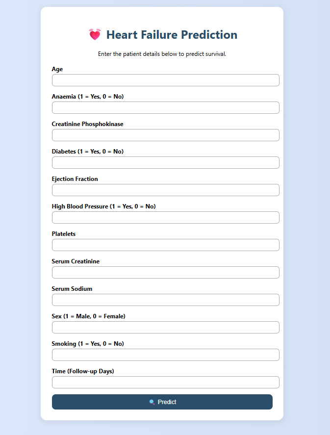
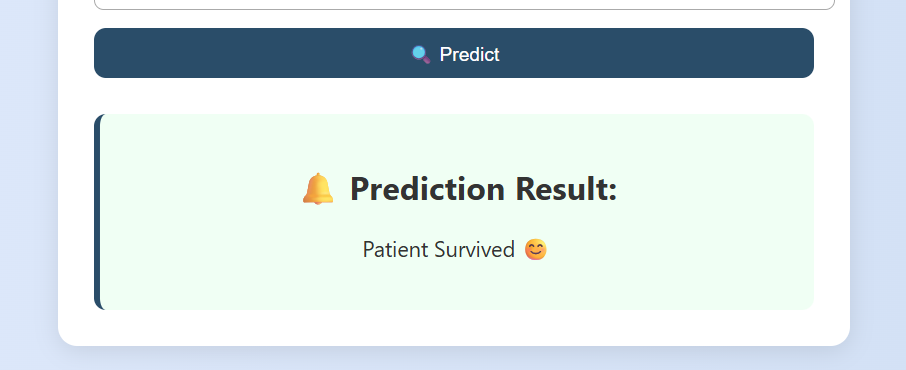

<h1 align="center">💓 Heart Failure Prediction App</h1>

<p align="center">
  Predict patient survival chances using Machine Learning and Flask 🚀
</p>

---

## 📷 Demo Screenshots

### 🧾 Input Form
<p align="center">
  
</p>
  <br>
  <hr>
  
  ### 🔍 Prediction Result
  
<p align="center">
  
</p>

---

## 🧠 About the Project

This is a simple Flask web application that uses a trained Random Forest model to predict the likelihood of death for heart failure patients based on clinical parameters.

- ✅ Built using Python, Flask, and Scikit-learn
- ✅ Predicts survival using 12 clinical input values
- ✅ Clean, user-friendly web interface
- ✅ Deployed locally via Flask

---

## 🧪 Features

- 📋 Input form for patient clinical data
- 🔮 Predict survival (`Patient Survived 😊` / `Patient Died 😞`)
- 💾 Pretrained model stored as `.pkl`
- 🎨 Clean UI using HTML and CSS

---

## 💻 Tech Stack

| Technology | Use |
|------------|-----|
| Python     | Programming Language |
| Pandas     | Data Processing |
| Scikit-learn | ML model |
| Flask      | Web Framework |
| HTML/CSS   | Frontend |
| VS Code    | Development |

---

## 🚀 How to Run Locally

```bash
# 1. Clone the repository
git clone https://github.com/YOUR_USERNAME/heart-failure-prediction.git

# 2. Navigate into the folder
cd heart-failure-prediction

# 3. Install requirements
pip install -r requirements.txt

# 4. Run the Flask app
python app.py
